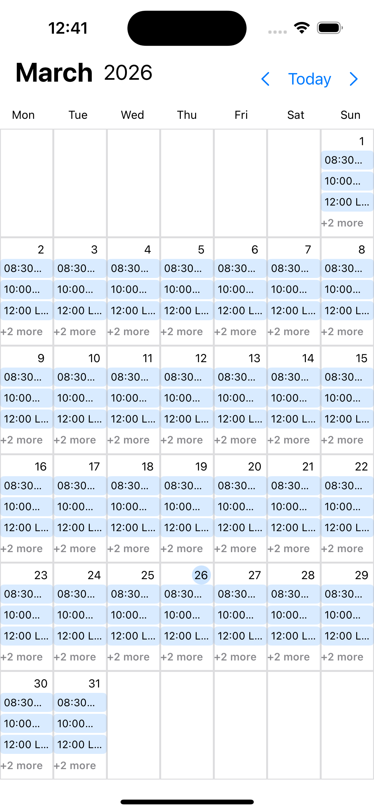
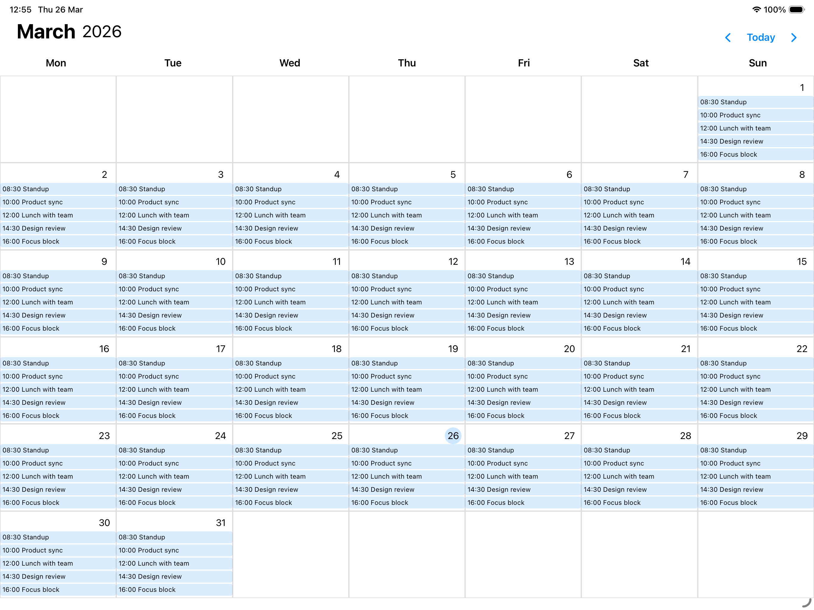

# CalendarKit

CalendarKit is a SwiftUI monthly calendar component you can embed in your app and fill with custom day content (events, badges, summaries, and more).

## Preview

### iPhone



### iPad



### Video

[iPad landscape demo video](Docs/Images/calendarkit-demo-ipad-landscape.mov)

## Requirements

- iOS 18.0+
- Swift Package Manager

## Installation

### Xcode (Git URL)

1. In Xcode: `File > Add Package Dependencies...`
2. Enter repository URL -> https://github.com/petracackov/CalendarKit.git

## Quick Start

```swift
import SwiftUI
import CalendarKit

struct CalendarScreen: View {
    @State private var selectedMonth: MonthUi = .currentMonth()

    var body: some View {
        CalendarView(
            selectedMonth: $selectedMonth,
            style: CalendarStyle(
                tintColor: .blue,
                fontColor: .primary,
                borderColor: .gray.opacity(0.3)
            ),
            onSelectedDate: { date in
                print("Selected date:", date)
            },
            dayContent: { date, context in
                DayCellContent(date: date, context: context)
            }
        )
    }
}
```

## Day Content Rendering

`dayContent` gives you:

- `date`: concrete day for the cell
- `context`: `CalendarDayContentContext` with available day-cell space helpers

Example:

```swift
struct DayCellContent: View {
    let date: Date
    let context: CalendarDayContentContext

    var body: some View {
        let maxRows = context.maxItems(itemHeight: 18, verticalSpacing: 2)

        VStack(alignment: .leading, spacing: 2) {
            ForEach(0..<maxRows, id: \.self) { _ in
                Text("Event")
                    .font(.caption2)
                    .lineLimit(1)
            }
            Spacer()
        }
    }
}
```

## UI Customization

You can customize these parts of the calendar UI today:

- **Color scheme** via `style: CalendarStyle(...)`
  - `tintColor` (navigation icons, Today action, today highlight)
  - `fontColor` (month/year title, weekday labels, day numbers)
  - `borderColor` (day cell borders)
- **Day cell content** via `dayContent` closure
  - render your own event rows, badges, counters, or placeholders per date
  - use `CalendarDayContentContext` to fit content to available cell height/width
- **Visible month state** via `selectedMonth: Binding<MonthUi>`
  - control current month from parent state
  - programmatically jump to another month
- **Date tap handling** via `onSelectedDate`
  - connect calendar taps to navigation, detail sheets, or selection logic

Note: layout metrics and typography are currently internal; color/style and day-content rendering are the main public customization points.

## Example App

An example consumer app is included at:

`Example/CalendarTest`

It is wired to the local package and can be used as a playground while developing CalendarKit.
