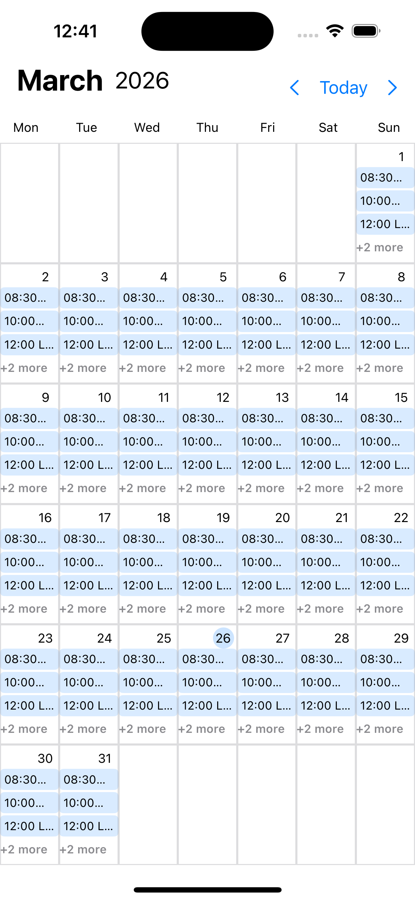
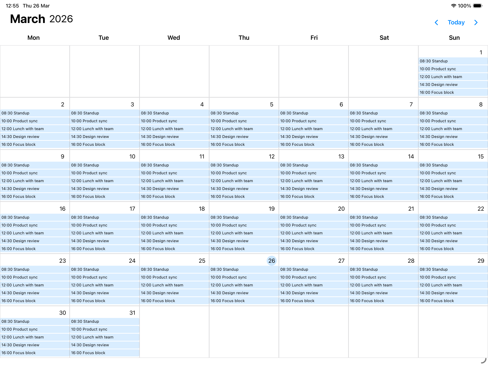
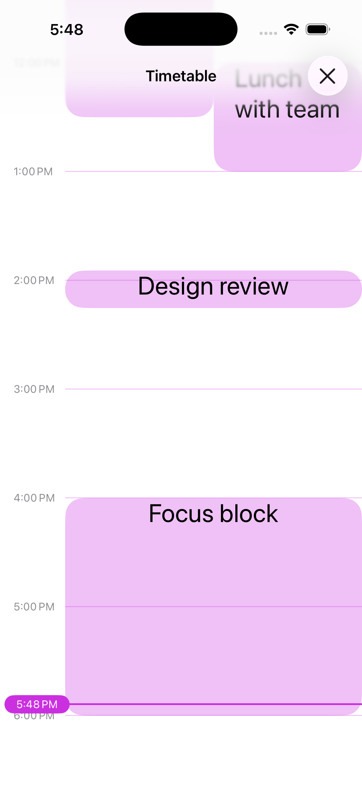

# CalendarKit

CalendarKit is a SwiftUI calendar package with a customizable monthly calendar and a scrollable day timetable for event-style content.

## Preview

### iPhone



### iPad



### Timetable



### Video

[iPad landscape demo video](Docs/Images/calendarkit-demo-ipad-landscape.mov)

## Requirements

- iOS 18.0+
- Swift Package Manager

## Installation

### Xcode (Git URL)

1. In Xcode: `File > Add Package Dependencies...`
2. Enter repository URL -> https://github.com/petracackov/CalendarKit.git

## Quick Start

```swift
import SwiftUI
import CalendarKit

struct CalendarScreen: View {
    @State private var selectedMonth: MonthUi = .currentMonth()

    var body: some View {
        CalendarView(
            selectedMonth: $selectedMonth,
            style: CalendarStyle(
                tintColor: .blue,
                fontColor: .primary,
                borderColor: .gray.opacity(0.3)
            ),
            onSelectedDate: { date in
                print("Selected date:", date)
            },
            dayContent: { date, context in
                DayCellContent(date: date, context: context)
            }
        )
    }
}
```

## Day Content Rendering

`dayContent` gives you:

- `date`: concrete day for the cell
- `context`: `CalendarDayContentContext` with available day-cell space helpers

Example:

```swift
struct DayCellContent: View {
    let date: Date
    let context: CalendarDayContentContext

    var body: some View {
        let maxRows = context.maxItems(itemHeight: 18, verticalSpacing: 2)

        VStack(alignment: .leading, spacing: 2) {
            ForEach(0..<maxRows, id: \.self) { _ in
                Text("Event")
                    .font(.caption2)
                    .lineLimit(1)
            }
            Spacer()
        }
    }
}
```

## Day Timetable

`DayTimetableView` renders a scrollable 24-hour timetable from an array of `Interval` values. You provide the day, interval dates, and the SwiftUI content for each interval.

```swift
import SwiftUI
import CalendarKit

struct TimetableScreen: View {
    // Intervals are your timetable items with start and end dates.
    let intervals: [Interval]

    var body: some View {
        DayTimetableView(
            date: Date(),
            style: TimetableStyle(
                intervalColor: .blue.opacity(0.2),
                fontColor: .secondary,
                timeIndicatorColor: .gray.opacity(0.3),
                currentTimeIndicatorColor: .blue,
                indicatorFontColor: .white
            ),
            intervals: intervals
        ) { interval in
            Text("Event")
                .font(.caption)
                .frame(maxWidth: .infinity, maxHeight: .infinity, alignment: .topLeading)
                .padding(8)
        }
    }
}
```

Overlapping intervals are laid out side by side. When the timetable date is today, it also shows a current-time indicator that updates periodically.

For short events, you can provide adaptive content. `DayTimetableView` tries the large view first, then falls back to the mid and small views using `ViewThatFits`.

```swift
DayTimetableView(
    date: Date(),
    intervals: intervals,
    largeContent: { interval in
        VStack(alignment: .leading) {
            Text("Event")
                .font(.headline)
            Text(interval.start, style: .time)
                .font(.caption)
        }
        .padding(8)
    },
    midContent: { _ in
        Text("Event")
            .font(.caption)
            .lineLimit(1)
    },
    smallContent: { _ in
        Color.clear
    }
)
```

## UI Customization

### Monthly Calendar

- **Color scheme** via `style: CalendarStyle(...)`
  - `tintColor` (navigation icons, Today action, today highlight)
  - `fontColor` (month/year title, weekday labels, day numbers)
  - `borderColor` (day cell borders)
- **Day cell content** via `dayContent` closure
  - render your own event rows, badges, counters, or placeholders per date
  - use `CalendarDayContentContext` to fit content to available cell height/width
- **Visible month state** via `selectedMonth: Binding<MonthUi>`
  - control current month from parent state
  - programmatically jump to another month
- **Date tap handling** via `onSelectedDate`
  - connect calendar taps to navigation, detail sheets, or selection logic

### Day Timetable

- **Color scheme** via `style: TimetableStyle(...)`
  - `intervalColor` (interval background color)
  - `fontColor` (hour label color)
  - `timeIndicatorColor` (hour separator line color)
  - `currentTimeIndicatorColor` (current-time line and capsule color)
  - `indicatorFontColor` (current-time text color)
- **Interval content** via the `intervalContent` closure or adaptive `largeContent`, `midContent`, and `smallContent` closures
  - render your own event cards, labels, icons, or custom layout for each `Interval`
- **Schedule data** via `intervals: [Interval]`
  - provide start and end dates for each timetable item
  - overlapping intervals are automatically laid out side by side

Note: layout metrics and typography are currently internal; color/style, day-content rendering, and timetable interval rendering are the main public customization points.

## Example App

An example consumer app is included at:

`Example/CalendarTest`

It is wired to the local package and can be used as a playground while developing CalendarKit.
